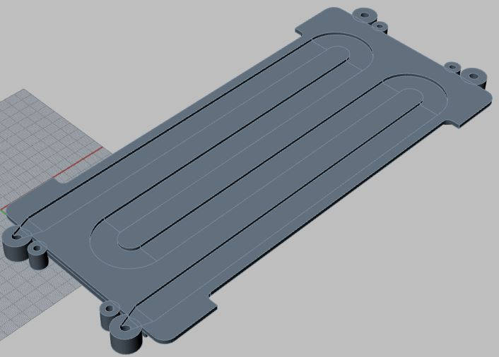
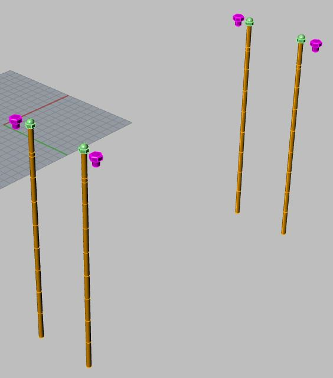
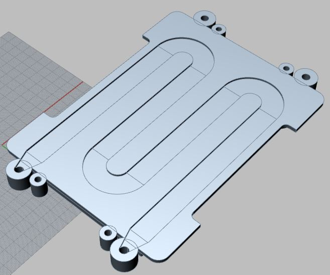

# Zur Weiterführung der im eSat Projekt erstellten KISS-Batterie und zur Analyse der Ergebnisse, sollte diese in Rhino/Grasshopper neu aufgebaut werden.
# Die Neukonstruktion soll weitesgehend parametrisch sein.

KISS Batterie aus dem eSat Projekt

## Die folgenden Eingabeparameter sollen vom Anwender parametrisch gesteuert werden können:

* Anzahl der Pouchzellen
* Anzahl der Module
* Plattenstärken
* Querschnitt des Kühlkanals als Rechteck (Breite und Tiefe)
* Übergang des Kühlkanals zum Ein- bzw. Auslass
* Diverse Anbauteile

## Folgende Anbauteile werden erstellt:

* Verschlussschrauben der Kühlkanäle
* Verschraubungen der Module incl. Muttern
* Verkabelung der Pouchzellen
* BMS
* Rohrstücke (Schläuche) für den Ein- und Ausslass der Kühlung
* Gehäuse mit seperatem Deckel

## Die folgenden Daten sollen aus Grasshopper augelesen werden können:

* Bauteile als STP-File (obj-File)
* Anzahl der jeweiligen Bauteile als STP-File zur Erstellung einer Stückliste
* Metadaten der Bauteile, (z.B. Material, Masse, Querschnitt und ges. Länge des Kühlkanals)
* ...
* ...

## Die Konstuktion soll in Grasshopper per json-File mit den folgenden Daten gesteuert werden können z.B.:

* 'assy_id': 'Name xxx', Benennung
* 'nracks': 9, Anzahl der Module
* 'ncells': 8, Anzahl der Pouchzellen
* 'channel_width': 12.0, Kühlkanal Breite
* 'channel_height': 2.0, Kühlkanal Tiefe
* 'twall': 1.2, Wandstärke zweischen Kühlkanal und Pouchzelle

### Dies ermöglicht die schnelle Erstellung von unterschiedlichen Varianten zur Simulation

# Im Stand vom 18.03.2021 wurde folgendes umgesetzt:

Parametrisches Modell mit den oben angegebenen Anforderungen

Erstellte Anbauteile:

* Verschlussschrauben der Kühlkanäle
* Verschraubung der Module
* BMS

Noch nicht erstellte Anbauteile:

* Verkabelung der Pouchzellen
* Rohrstücke (Schläuche) für den Ein- und Ausslass der Kühlung
* Gehäuse mit seperatem Deckel

# Darstellungen der erstellten Bauteile

*Neue KISS Batterie als Rhino/Grasshopper Modell*

*Abdeckplatte*

*Grundplatte ohne Kühlkanal*

*Grundplatte mit Kühlkanal*

*16 Pouchzellen*

*Verschraubungen*

*BMS*

*Grundplatte mit parametrischem Kühlkanal 8x3mm*

*Grundplatte mit parametrischem Kühlkanal 20x2mm*

*KISS Batterie parametrisch, mit 5 Modulen und 50 Pouchzellen*

# Ansteuern von Grasshopper per json-File

* noch nicht umgesetzt

# Auslesen der relevanten Bauteile als stp-File

* ... Beispiel
* ...