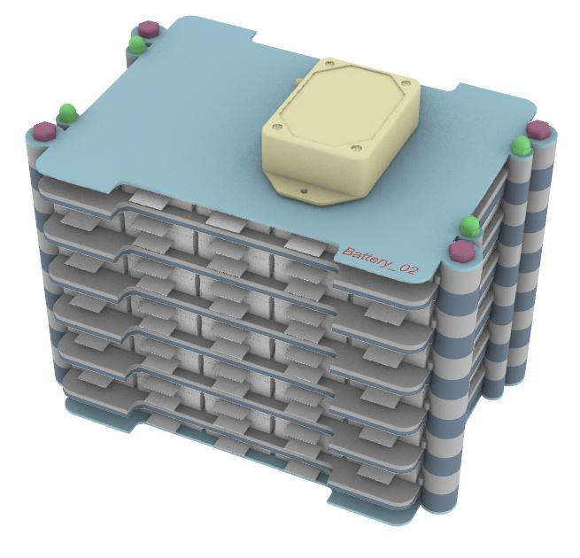

# Zur Weiterführung der im eSat Projekt erstellten KISS-Batterie und zur Analyse der Ergebnisse, sollte diese in Rhino/Grasshopper neu aufgebaut werden.
# Die Neukonstruktion soll weitesgehend parametrisch sein.

KISS Batterie aus dem eSat Projekt

## 1. Die folgenden Eingabeparameter sollen vom Anwender parametrisch gesteuert werden können:

* Anzahl der Pouchzellen
* Anzahl der Module
* Plattenstärken
* Wandstärke zwischen dem Kühlkanal und den Pouchzellen
* Querschnitt des Kühlkanals als Rechteck (Breite und Tiefe)
* Übergang des Kühlkanals zum Ein- bzw. Auslass
* Diverse Anbauteile

## 1.1 Folgende Anbauteile werden erstellt:

* Verschlussschrauben der Kühlkanäle
* Verschraubungen der Module incl. Muttern
* Verkabelung der Pouchzellen
* BMS
* Rohrstücke (Schläuche) für den Ein- und Ausslass der Kühlung
* Gehäuse mit seperatem Deckel

## 1.2 Die folgenden Daten sollen aus Grasshopper augelesen werden können:

* Bauteile als STP-File (obj-File)
* Anzahl der jeweiligen Bauteile als STP-File zur Erstellung einer Stückliste
* Metadaten der Bauteile, (z.B. Material, Masse, Querschnitt und ges. Länge des Kühlkanals)
* ...
* ...

## 1.3 Die Konstuktion soll in Grasshopper per json-File mit den folgenden Daten gesteuert werden können z.B.:

* 'assy_id': 'Name xxx', Benennung
* 'nracks': 9, Anzahl der Module
* 'ncells': 8, Anzahl der Pouchzellen
* 'channel_width': 12.0, Kühlkanal Breite
* 'channel_height': 2.0, Kühlkanal Tiefe
* 'twall': 1.2, Wandstärke zweischen Kühlkanal und Pouchzelle

### Dies ermöglicht die schnelle Erstellung von unterschiedlichen Varianten zur Simulation

# 2. Im Stand vom 18.03.2021 wurde folgendes umgesetzt:

## 2.1 Parametrisches Modell mit den oben angegebenen Anforderungen

## 2.2 Erstellte Anbauteile:

* Verschlussschrauben der Kühlkanäle
* Verschraubung der Module
* BMS

## 2.3 Noch nicht erstellte Anbauteile:

* Verkabelung der Pouchzellen
* Rohrstücke (Schläuche) für den Ein- und Ausslass der Kühlung
* Gehäuse mit seperatem Deckel

# 3. Darstellungen der erstellten Bauteile

*Neue KISS Batterie als Rhino/Grasshopper Modell*

*Abdeckplatte*

*Grundplatte ohne Kühlkanal*

*Grundplatte mit Kühlkanal*

*16 Pouchzellen*

*Verschraubungen*

*BMS*

*Grundplatte mit parametrischem Kühlkanal 8x3mm*

*Grundplatte mit parametrischem Kühlkanal 20x2mm*

*KISS Batterie parametrisch, mit 5 Modulen und 50 Pouchzellen*

# 4. Ansteuern von Grasshopper per json-File

Die Auslegung der KISS Batterie wird in Rhino/Grasshopper durch die manuelle Eingabe der gewünschten Parameter wie z.B. die Anzahl der Pouchzellen, die Anzahl der Module, oder die Querschnittsangaben des Kühlkanals durchgeführt. Dies hat zu Folge, das immer nur ein Modell generiert wird und der Anwender für eine andere Auslegung die hierfür notwendigen Parameter erneut manuell festlegen muss. Hierdurch ist eine schnelle Analyse unterschiedlicher Battrie Auslegungen nicht gegeben.

Damit eine grosse Anzahl unterschiedlicher Auslegungen in möglichst kurzer Zeit ohne den Anwender erstellt und analysiert werden kann, soll es möglich ermöglicht werden,bereits vordefinierte Auslegungen in einer Datei anzugeben, welche alle notwendigen Parameter beinhalten. Als Eingabeformat wurde .json gewählt.

*Beispiel einer .json Input Datei*

Mittels eines Python Scrpts wird die json-Datei eingelesen und in ein für Grasshopper "lesbares" Format (object) umgewandelt. In einem weiteren Schritt werden automatisch die gewünschen Daten ausgelesen und an die jeweiligen Module übermittelt. Diese generieren daraufhin automatisch die gewünsche Auslegung.

*Einlesen und umwandeln der json-Datei*

*Auslesen der notwendigen Daten*

Mittels einer vorher definierten Benennung, welche ebenfalls im Modell dargestellt wird, kann für die Analyse eine eindeutige Zuordnung der unterschiedlichen Auslegungen stattfinden.

*Benennungen der unterschiedlichen Auslegungen*

*Auslegung mit 10 Modulen und 140 Pouchzellen*

*Auslegung mit 6 Modulen und 60 Pouchzellen*

# 5. Auslesen der relevanten Bauteile als stp-File

* ... Beispiel
* ...