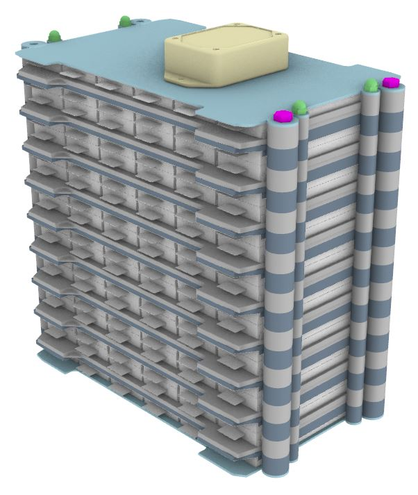

# Zur Weiterführung der im ESat Projekt erstellten KISS-Batterie und zur Analyse der Ergebnisse, sollte diese in Rhino/Grasshopper neu aufgebaut werden.
# Diese sollte weitesgehend parametrisch sein.

KISS Batterie aus dem ESat Projekt

## Die folgenden Eingabeparameter sollen vom Anwender parametrisch gesteuert werden können:

* Anzahl der Pouchzellen
* Anzahl der Module
* Plattenstärke
* Querschnitt des Kühlkanals als Rechteck (Breite und Tiefe)
* Übergang des Kühlkanals zum Ein- bzw. Auslass

## Folgende Anbauteile werden erstellt:

* Verschlussschrauben der Kühlkanäle
* Verschraubung der Module
* Verkabelung der Pouchzellen
* BMS
* Rohrstücke (Schläuche) für den Ein- und Ausslass der Kühlung
* Gehäuse mit seperatem Deckel

## Die folgenden Daten sollen augelesen werden können:

* Bauteile als STP-File (obj-File)
* Anzahl der jeweiligen Bauteile als STP-File zur Erstellung einer Stückliste
* Metadaten der Bauteile (z.B. Material, Masse, Querschnitt und ges.Länge des Kühlkanals)
* ...
* ...

# Im Stand vom 16.03.2021 wurde folgendes umgesetzt:

Parametrisches Modell mit den oben angegebenen Anforderungen

Als Anbeuteile sind vorhanden:

* Verschlussschrauben der Kühlkanäle
* Verschraubung der Module
* BMS

Neue KISS Batterie als Rhino/Grasshopper Modell

Platte mit Kühlkanal

